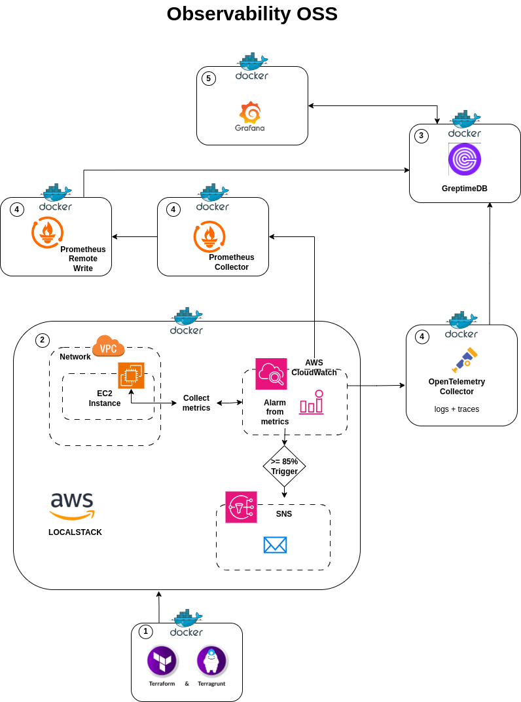

# Solution
The purpose of this code is to share the Terragrunt and Terraform code to create an observability lab in Localstack (AWS emulator in local). The laboratory contains code with different examples that can will be used in production scenarios.


## Requirements
- Podman >= 3.4.2
- Podman-compose >= 1.0.3
### Alternative requirements with Docker and Docker-compose
- Docker >= 1.0.0
- Docker-compose >= 1.0.0
- Edit "docker-compose.yml", discoment and comment some lines referenced in file

## docker-compose.yml
- In my case i use 'podman-compose' because its safety and performance than 'docker-compose' 
- For security only need to enable and expose the 'podman API socket' taking advantage of the native 
  features of 'rootless' in 'Podman'. It is required to run inside physical system native:
```bash
# Execute with anybody "rootless" user
systemctl --user start podman.socket
```
- Terraform and Terragrunt require fake credentials. Exported fake credentials inside the 'admtools' container

```bash
# Build containers, from clone source:
podman-compose build
# Start containers:
podman-compose up -d
```


### 1. Terragrunt & Terraform

- The endpoints are name of the container and it is pointed to the internal service ports for localstack
  [For more information about it.](https://docs.localstack.cloud/references/external-ports/)
- Disabled the resource s3 because has a problem with fake credentials and blocks modules execution. It is recommended to upload the tfstate to s3 if working in team.
- Created especific directorys for each Terraform module and Terragrunt module.
- changed how it runs Terraform modules, now works with dependencies and dependency of Terragrunt 
syntaxies. EC2 requiere an output from terraform VPC module.
- tree files:

```ini
|-obs-lab-+-[{root project, terragrunt conf will generate provider for terraform modules}]
|         |-modules---[{modules of terraform}]
|         |-prod-+-[{General variables inputs for terragrunt/terraform and dependencies}]
|                |-[{modules of terragrunt for "production" env}]-
```

- From admtools container, move into directory '/root/prod' and execute:
```bash
# /root/prod/
terragrunt run-all init --terragrunt-log-level debug
##If is necessary reset init:
terragrunt run-all init -upgrade --terragrunt-log-level debug
##Then plan and apply
terragrunt run-all plan --terragrunt-log-level debug
terragrunt run-all apply --terragrunt-log-level debug
```
- checks after execute
```bash
# If enable S3 resource in "/root/terragrunt.hcl": 
aws --endpoint-url=http://localstack:4566 s3 ls
# Check ec2 resource in localstack
aws --endpoint-url=http://localstack:4566 ec2 describe-instances
aws --endpoint-url=http://localstack:4566 ec2 describe-subnets
# Check cloudwatch in localstack
aws --endpoint-url=http://localstack:4566 cloudwatch describe-alarms
```


## Observability

### 2. Prometheus collector & remote write
#### promcol-lab container
The best way to get metrics from AWS Cloudwatch is by using Prometheus to achieve it. However, it has a bug when
trying to fetch metrics from an EC2 instance on Localstack. But let's imagine it works.

So, it's not necessary to create fake metrics, but I had already designed a samall script that
does it. To run it:

```BASH
#From 'admtools' container:
/root/containers/admtools/do_fk_metrics_aws.sh &

#SOME INTERESTING COMMANDS:
#Note: Replace all for instanceId generated by Terraform

# Get instance ID of EC2
aws --endpoint-url=http://localstack:4566 ec2 describe-instances --query \
  "Reservations[*].Instances[*].InstanceId"

# Create a fake metrics
aws --endpoint-url=http://localstack:4566 cloudwatch put-metric-data \
    --metric-name CPUUtilization \
    --namespace EC2 \
    --dimensions InstanceId=i-ec09fb2a517b5d124 \
    --value 70.2 \
    --unit Percent

# Get all metrics
aws --endpoint-url=http://localstack:4566 cloudwatch list-metrics

# Get datapoints of ec2 metric
aws --endpoint-url=http://localstack:4566 cloudwatch get-metric-statistics --namespace EC2 --metric-name CPUUtilization --period 60 --start-time 1737969900 --end-time 1737971574 --statistics Maximum --dimensions Name=InstanceId,Value=i-aa54280b70f78b651
```


### 3. GreptimeDB OSS
